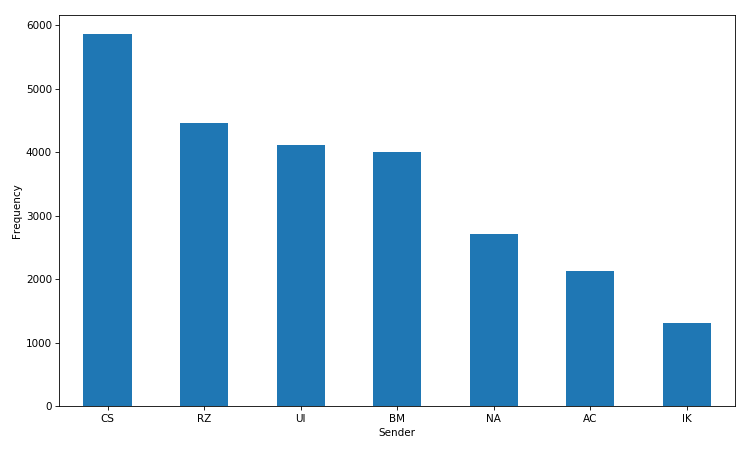
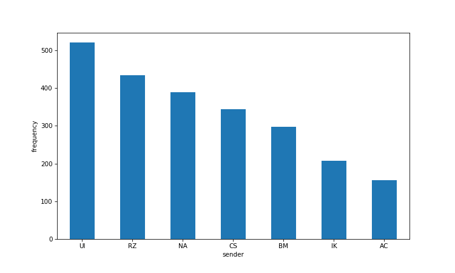

# Exploring WhatsApp chats with Python

WhatsApp has a functionality that enables you to download the conversation logs of individual and group chats.  To do this, just select any conversation, click on the dots on the top right, click on 'More' then 'Email chat'.  You can then email to yourself the chat logs as a text file.

### Parsing the data

The text file is a time-ordered list of events that occurs within the chat mostly made up of text messages but also multimedia messages, addition and removal of group participants etc.  Each line is a single message and is in the following format:  

`date, time - sender: message`

We can use Python to parse the text file into a tabular format suitable for analysis.  The task here is to extract the three components from each line - timestamp, sender and message.  The first challenge was to use regular expressions to account for messages that have more than one line break.  The full function that returns the Pandas dataframe is as below.  The data is from one particular group chat going back 2 years.

```python
import pandas as pd
import re

def parse_file(text_file):
    '''Convert WhatsApp chat log text file to a Pandas dataframe.'''
    
    # some regex to account for messages taking up multiple lines
    pat = re.compile(r'^(\d\d\/\d\d\/\d\d\d\d.*?)(?=^^\d\d\/\d\d\/\d\d\d\d|\Z)', re.S | re.M)
    with open(text_file) as f:
        data = [m.group(1).strip().replace('\n', ' ') for m in pat.finditer(f.read())]

    sender = []; message = []; datetime = []
    for row in data:

        # timestamp is before the first dash
        datetime.append(row.split(' - ')[0])

        # sender is between am/pm, dash and colon
        try:
            s = re.search('m - (.*?):', row).group(1)
            sender.append(s)
        except:
            sender.append('')

        # message content is after the first colon
        try:
            message.append(row.split(': ', 1)[1])
        except:
            message.append('')

    df = pd.DataFrame(zip(datetime, sender, message), columns=['timestamp', 'sender', 'message'])
    df['timestamp'] = pd.to_datetime(df.timestamp, format='%d/%m/%Y, %I:%M %p')

    # remove events not associated with a sender
    df = df[df.sender != ''].reset_index(drop=True)
    
    return df

df = parse_file('chat_data_anon.txt')
```

### Analysis

With this dataset we can now do some exploratory analysis.  In total we have 24,619 messages from 7 members of the group.  Let's look at who sends the most messages in the group.



However, this doesn't take into account multiple messages sent by the same person consecutively.  These messages usually form part of the same message stream and should be grouped together as a single message.  

```python
x = df.sender.values

names = []; message_length = []
# generates a new group every time the value of the list changes
# https://docs.python.org/2/library/itertools.html#itertools.groupby
for k, g in itertools.groupby(x):
    names.append(k)
    message_length.append(len(list(g)))
    
df2 = pd.DataFrame(zip(names, message_length), columns=['sender', 'length'])
```

We now have 13,979 messages, indicating that on average nearly 2 messages are sent by the same person consecutively.  This results in only one change in the order of most frequent senders.


At what time of the day do messages get sent?


On which days have the most messages been sent?


Who sends the longest messages?  The table shows the mean length of messages in terms of characters and words.

```python
df['characters'] = df.message.apply(len)
df['words'] = df.message.apply(lambda x: len(x.split()))

df.groupby('sender').mean().sort_values('characters').round(2)
```

| sender   | characters  | words  |
| -------- |-------------| -----  |
| BM       | 25.48		 | 4.79   |
| UI       | 29.17       | 5.52   |
| RZ 	   | 29.76       | 5.75   |
| CS 	   | 34.75       | 6.67   |
| IK 	   | 35.98       | 6.55   |
| AC 	   | 36.74       | 7.37   |
| NA 	   | 42.29       | 7.39   |

What are the most common messages sent?

```python
df.message.value_counts().head(20)
```

| message   | frequency  |
| ------------ |-------------|
| <Media omitted>       | 835		 |
| Lol       | 268      |
| 😂 	   | 153      |
| Yh 	   | 101      |
| Haha 	   | 80       |
| 😂😂😂 	   | 79       |
| Yeah 	   | 72       |
| ? 	   | 62      |
| lol 	   | 59       |
| Loool 	   | 55       |
| Yea 	   | 52       |
| Looool 	   | 45       |
| Lool 	   | 37       |
| Yhh 	   | 35       |
| Hahaha 	   | 34       |
| 👀 	   | 28      |
| Nah 	   | 24       |
| Hmm 	   | 24       |
| 😂😂 	   | 21       |
| No 	   | 20      |  

`<Media omitted>` refers to the sending of multimedia messages.  The most popular single messages seem to be about expressing amusement and responding in the affirmative or negative.  What about if we split the messages up into their individual words?

```python
words = ''
for i in df.message.values:
    words += '{} '.format(i.lower()) # make words lowercase

pd.DataFrame(Counter(words.split()).most_common(20), columns=['word', 'frequency'])
```

| word | frequency |
|------|-----------|
| the  | 4567      |
| to   | 3149      |
| i    | 3037      |
| a    | 2698      |
| and  | 2545      |
| you  | 2531      |
| it   | 2332      |
| is   | 2022      |
| in   | 1889      |
| of   | 1688      |
| that | 1561      |
| for  | 1460      |
| but  | 1245      |
| on   | 1190      |
| be   | 1143      |
| was  | 1069      |
| yeah | 1036      |
| so   | 898       |
| have | 871       |
| lol  | 869       |  

In total we get over 151,141 words made up of 16,164 unique words.  As we would expect in a large enough corpus of text, the most common words are [stop words](https://en.wikipedia.org/wiki/Stop_words).  Instead we can filter out these stop words using the `nltk` package.

```python
from nltk.corpus import stopwords
for i in Counter(words.split()).most_common(60):
    if i[0] not in stopwords.words('english'):
        print i[0] + ',',
```

```python
yeah, lol, <media, omitted>, it's, good, like, i'm, one, get, that's, think, don't, really, go, man, know,
```

What can we say about distinct conversations within the group chat?  Let's define a conversation as a stream of messages where the gap between any two messages is not longer than 20 minutes.  

```python
# find time difference between current and previous message
df['reply_time'] = (df.timestamp.shift(-1) - df.timestamp).apply(lambda x: x.total_seconds()/60).fillna(np.inf)
# if reply time is more than 20 mins add 1 to counter
df['conversation'] = (df.reply_time > 20).cumsum().shift(1).fillna(0).astype(int) + 1

df3 = df.groupby('conversation').agg({'timestamp': ['min', 'max', 'count'], 
                                      'sender': ['first', 'unique', 'nunique']})

df3['duration'] = (df3['timestamp']['max'] - df3['timestamp']['min']).apply(lambda x: x.total_seconds()/60)
```

By this method we identify 2,350 conversations. The average conversation lasts 11.3 minutes, is made up of 10.5 messages from 2 participants.  Who starts the most conversations?



Finally, there is plenty of scope to do further analysis on this dataset.  We can look at conversation dynamics, network analysis of who replies to who, explore sentiment of messages and identify topics etc.

[Home](../index.md)