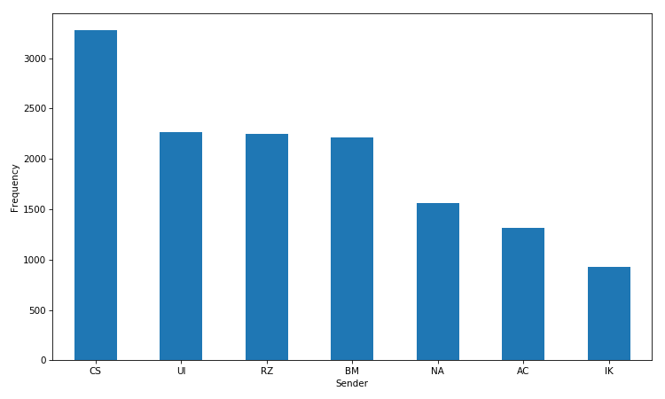
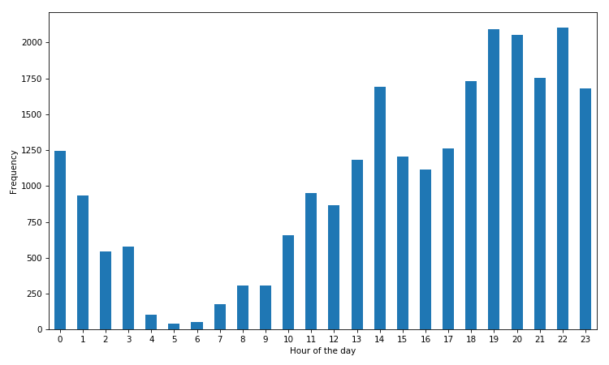

# Exploring WhatsApp chats with Python

WhatsApp has a functionality that enables you to download the conversation logs of individual and group chats.  To do this, just select any conversation, click on the dots on the top right, click on 'More' then 'Email chat'.  You can then email to yourself the chat logs as a text file.

### Parsing the data

The text file is a time-ordered list of events that occur within the chat mostly made up of text messages but also multimedia messages, addition and removal of group participants etc.  Each line is a single message and is in the following format:  

`date, time - sender: message`

We can use Python to parse the text file into a tabular format suitable for analysis.  The task here is to extract the three components for each line - timestamp, sender and message.  The first challenge was to use regular expressions to account for messages that have at more than one line break.  The full function that returns the Pandas dataframe is as below.  The data is from one particular group chat going back 2 years.

```python
import pandas as pd
import re

def parse_file(text_file):
    '''Convert WhatsApp chat log text file to a Pandas dataframe.'''
    
    # some regex to account for messages taking up multiple lines
    pat = re.compile(r'^(\d\d\/\d\d\/\d\d\d\d.*?)(?=^^\d\d\/\d\d\/\d\d\d\d|\Z)', re.S | re.M)
    with open(text_file) as f:
        data = [m.group(1).strip().replace('\n', ' ') for m in pat.finditer(f.read())]

    sender = []; message = []; datetime = []
    for row in data:

        # timestamp if before the first dash
        datetime.append(row.split(' - ')[0])

        # sender is between am/pm, dash and colon
        try:
            s = re.search('m - (.*?):', row).group(1)
            sender.append(s)
        except:
            sender.append('')

        # message content is after the first colon
        try:
            message.append(row.split(': ', 1)[1])
        except:
            message.append('')

    df = pd.DataFrame(zip(datetime, sender, message), columns=['timestamp', 'sender', 'message'])
    df['timestamp'] = pd.to_datetime(df.timestamp, format='%d/%m/%Y, %I:%M %p')

    # remove events no associated with a sender
    df = df[df.sender != ''].reset_index(drop=True)
    
    return df

df = parse_file('chat_data_anon.txt')
```

### Analysis

With this dataset we can now do some exploratory analysis.  In total we have 24,619 messages from 7 members of the group.  Let's look at who sends the most messages in the group.


However, this doesn't take into account multiple messages sent by the same person consecutively.  These messages usually form part of the same message stream and should be grouped together as a single message.  

```python
x = df.sender.values

names = []; message_length = []
# generates a new group every time the value of the list changes
# https://docs.python.org/2/library/itertools.html#itertools.groupby
for k, g in itertools.groupby(x):
    names.append(k)
    message_length.append(len(list(g)))
    
df2 = pd.DataFrame(zip(names, message_length), columns=['sender', 'length'])
```

We now have 13,979 messages, indicating that on average nearly 2 messages are sent by the same person consecutively.  This only results in only one change in the order of most frequent senders.



At what time of the day do messages get sent?




Who sends the longest messages?  The table shows the mean length of messages in terms of characters and words.

```python
df['characters'] = df.message.apply(len)
df['words'] = df.message.apply(lambda x: len(x.split()))

df.groupby('sender').mean().sort_values('characters').round(2)
```

| sender   | characters  | words  |
| -------- |-------------| -----  |
| BM       | 25.48		 | 4.79   |
| UI       | 29.17       | 5.52   |
| RZ 	   | 29.76       | 5.75   |
| CS 	   | 34.75       | 6.67   |
| IK 	   | 35.98       | 6.55   |
| AC 	   | 36.74       | 7.37   |
| NA 	   | 42.29       | 7.39   |


